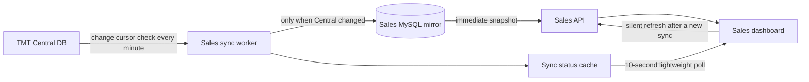

# Finance-to-Sales Data Workflow

## Runtime behavior

1. The browser immediately requests `GET /api/sales-dashboard`, which reads the existing consistent MySQL snapshot. It never waits for Central DB.
2. The systemd timer runs `php artisan sales:sync-finance` every minute.
3. The worker checks Central's monotonic change cursor. When nothing changed, it exits without rebuilding the mirror.
4. When Central changed, the worker validates and writes the new Finance snapshot to MySQL inside a database transaction.
5. The browser polls `GET /api/finance-sync/status`, a small status response, every 10 seconds.
6. After `syncedAt` changes, the browser silently replaces its data from `GET /api/sales-dashboard`. Existing content remains visible throughout.

The workflow uses a distributed cache lock to prevent overlapping automatic or manual synchronization runs. Finance verification remains authoritative; Sales never promotes pending records itself.
